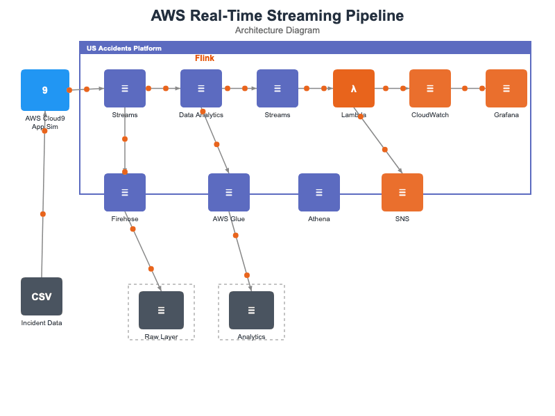

# aws-real-time-streaming-pipeline


## Overview
A scalable data engineering pipeline built with AWS CDK.

## 🏗️ Architecture



## Tech Stack
- **IaC:** AWS CDK (Python)
- **Compute:** AWS Lambda / Glue
- **Storage:** Amazon S3
- **Analytics:** Amazon Athena

## 📂 Project Structure
```
aws-real-time-streaming-pipeline/
├── app.py
├── cdk.json
├── stacks/
│   ├── ingest_stack.py
│   ├── transform_stack.py
│   └── analytics_stack.py
├── lambda/
│   └── etl_handler.py
└── requirements.txt
```

## 🚀 Getting Started
```bash
pip install -r requirements.txt
cdk bootstrap
cdk deploy --all
```

## License
MIT
